# What is Retrieval-Augmented Generation (RAG)?

> **Target Audience**
>
> Backend Engineers • Platform Engineers • AI Engineers • Solution Architects

---

## Learning Objectives

By the end of this chapter you should understand:

- What Retrieval-Augmented Generation (RAG) is
- Why RAG exists
- When RAG should be used
- When RAG should **not** be used
- Why most production RAG problems are actually retrieval problems
- How RAG differs from Fine-Tuning

---

# Why Another RAG Guide?

If you've searched for "How to build RAG", you've probably seen something like this:

```python
loader = PDFLoader(...)
documents = loader.load()

chunks = splitter.split(documents)

db = Chroma.from_documents(chunks)

chain = RetrievalQA(...)
```

Congratulations.

You have a demo.

You **do not** have a production system.

---

Production RAG is much closer to building a **distributed search engine** than building an LLM application.

The LLM is only one component.

A production system must solve problems like:

- Document ingestion
- OCR
- Incremental indexing
- Chunking
- Retrieval quality
- Metadata filtering
- Access control
- Caching
- Observability
- Cost optimization
- Evaluation
- Hallucination detection

This handbook focuses on those engineering challenges.

---

# What is RAG?

Retrieval-Augmented Generation (RAG) is an architectural pattern that augments a Large Language Model with external knowledge retrieved **at inference time**.

Instead of relying only on the model's internal parameters, the application retrieves relevant information from a knowledge source and injects it into the prompt.


The important idea is simple:

> The **model provides reasoning**.
>
> The **retrieval system provides knowledge**.

---

# Why Does RAG Exist?

Large Language Models are impressive, but they have fundamental limitations.

## 1. Knowledge Becomes Outdated

Every model has a training cutoff.

Anything that happened after training is unknown unless external knowledge is provided.

Examples:

- Today's exchange rates
- Yesterday's incident report
- Updated company policy
- Newly released API documentation

RAG allows the application to retrieve current information without retraining the model.

---

## 2. Private Enterprise Data

An LLM cannot answer questions about:

- Internal documentation
- Slack messages
- Jira tickets
- GitHub repositories
- Customer support history
- Company wiki

Unless your application retrieves that information first.

---

## 3. Hallucinations

When the model lacks information, it may produce a plausible but incorrect answer.

This is commonly called a **hallucination**.

One of RAG's primary goals is to reduce hallucinations by grounding the model in trusted documents.

---

## 4. Fine-Tuning Isn't the Right Tool

Many teams assume they should fine-tune the model whenever they have company data.

Usually that's incorrect.

Knowledge changes frequently.

Model weights should not.

---

# Core Idea

Think of RAG as separating two responsibilities.

```text
Knowledge
        │
        ▼
 Retrieval System

Reasoning
        │
        ▼
     LLM
```

This separation has a huge advantage.

You can update the knowledge base without changing the model.

---

# A Mental Model

Imagine interviewing a software engineer.

You ask:

> "How does our payment service calculate settlement fees?"

The engineer probably doesn't memorize the implementation.

Instead they:

1. Open the documentation
2. Search the repository
3. Read the relevant section
4. Answer the question

That is exactly what a RAG system does.

---

# RAG Is Not a Model

One of the biggest misconceptions is that RAG is an AI model.

It is not.

RAG is an **application architecture**.

It combines multiple systems:

- Parsing
- Search
- Retrieval
- Ranking
- Prompt construction
- Large Language Models

The LLM is only one stage in the pipeline.

---

# Anatomy of a Production RAG System

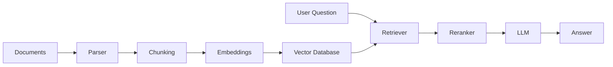

Notice that retrieval itself is an independent subsystem.

This distinction becomes increasingly important as document collections grow.

---

# When Should You Use RAG?

RAG works exceptionally well for knowledge-intensive applications.

Examples include:

- Internal documentation assistants
- Enterprise search
- Customer support bots
- Developer documentation
- API assistants
- Legal document search
- Healthcare knowledge systems
- Financial compliance assistants
- Contract analysis
- Codebase assistants

The common characteristic is that the answer depends on information stored outside the model.

---

# When Should You NOT Use RAG?

RAG is not a universal solution.

Avoid it when your primary goal is to change the model's behavior rather than its knowledge.

Examples:

- Adopting a particular writing style
- Enforcing a brand voice
- Producing a specific tone
- Learning a new reasoning pattern

These are generally better addressed with prompting or fine-tuning.

Similarly, if the required knowledge is small, static, and already well represented by the base model, introducing a retrieval layer may add unnecessary complexity and latency.

---

# Decision Tree

```text
Does the application need external knowledge?
                │
         ┌──────┴──────┐
         │             │
        No            Yes
         │             │
     Prompting     Does knowledge
    / Fine-tuning   change often?
                       │
                ┌──────┴──────┐
                │             │
               No            Yes
                │             │
      Fine-tuning      Production RAG
```

---

# Common Misconceptions

### ❌ "A bigger context window eliminates RAG."

No.

A larger context window reduces one constraint, but it does not replace retrieval, ranking, or relevance.

---

### ❌ "RAG is just a vector database."

No.

Vector search is only one component.

Production systems also require ingestion, ranking, metadata filtering, evaluation, monitoring, and security.

---

### ❌ "The LLM is the most important part."

Usually not.

Many production teams discover that improving retrieval quality has a much larger impact than switching to a newer language model.

---

# Engineering Insight

> **Production RAG is approximately:**
>
> - 60% Information Retrieval
> - 20% Data Engineering
> - 10% LLM Engineering
> - 10% Platform & Observability

This isn't a scientific ratio, but it's a useful way to prioritize your learning. Teams often spend too much time comparing models and not enough time measuring retrieval quality.

---

# Production Checklist

Before building your first RAG application, make sure you understand:

- [ ] What RAG solves
- [ ] Why retrieval is necessary
- [ ] The difference between retrieval and generation
- [ ] When RAG is the wrong solution
- [ ] The major architectural components of a RAG system

If any of these are unclear, spend time here before diving into embeddings or vector databases.

---

# Key Takeaways

✅ RAG is an architecture, not a model.

✅ The retrieval system and the LLM have distinct responsibilities.

✅ Retrieval quality largely determines answer quality.

✅ RAG is best suited for dynamic, private, or domain-specific knowledge.

✅ Production RAG systems are closer to search engines than chatbots.

---

# Recommended Resources

## Official Documentation

- OpenAI — Retrieval and Embeddings Guides
- Azure AI Search — RAG Documentation
- Qdrant Documentation
- Pinecone Learn

## YouTube

- Andrej Karpathy — Intro to LLMs
- Pinecone — What is RAG?
- Microsoft Developer — Building RAG Applications

## Research Papers

- Retrieval-Augmented Generation for Knowledge-Intensive NLP Tasks (Lewis et al., 2020)
- Dense Passage Retrieval for Open-Domain Question Answering (Karpukhin et al., 2020)

---

➡️ **Next Chapter:** Modern RAG Landscape

---
title: Modern RAG Landscape
description: Evolution of RAG architectures, production pipelines, and why demo RAG systems fail at scale.
author: ChatGPT
version: 1.0
---

# Modern RAG Landscape

> **Target Audience**
>
> Backend Engineers • Platform Engineers • AI Engineers • Solution Architects

---

# Learning Objectives

After completing this chapter, you should be able to:

- Explain the evolution of RAG architectures.
- Differentiate between Naive, Advanced, and Agentic RAG.
- Understand every component in a production RAG pipeline.
- Recognize why prototype systems fail in production.
- Identify which architectural improvements solve specific problems.

---

# The Evolution of RAG

RAG systems have evolved significantly over the past few years.

Most engineers begin with a simple architecture:

```text
User
  │
  ▼
Vector Search
  │
  ▼
LLM
```

This works surprisingly well for demos.

Unfortunately, it also breaks surprisingly quickly.

As document collections grow, users become more diverse, and enterprise requirements emerge, additional components become necessary.

The evolution generally looks like this:

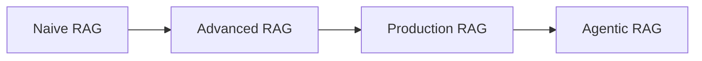

---

# Stage 1 — Naive RAG

The first generation of RAG systems consists of four steps.

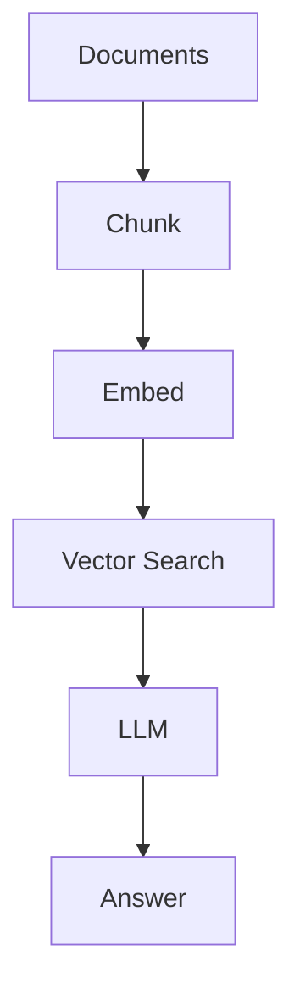

Advantages:

- Extremely easy to build
- Great for learning
- Excellent proof of concept

Typical technology stack:

- LangChain
- Chroma
- OpenAI Embeddings
- GPT model

Typical development time:

**Less than one day**

---

## Why Naive RAG Fails

As your corpus grows, several problems appear.

### Poor Recall

Relevant documents are never retrieved.

The LLM never even sees them.

---

### Duplicate Chunks

Similar paragraphs appear repeatedly.

Context becomes noisy.

---

### Bad Chunking

Important information is split across multiple chunks.

Neither chunk contains enough context individually.

---

### Exact Keywords Are Missed

Pure vector search understands semantics.

However, it may fail when users search for:

- Error codes
- Invoice IDs
- API names
- Function names
- Class names

---

### No Access Control

Every document is searchable.

This is unacceptable in enterprise environments.

---

### No Evaluation

Developers ask:

> "It feels better."

Instead of measuring:

- Recall@K
- Precision
- Faithfulness

---

# Stage 2 — Advanced RAG

The next generation improves retrieval quality.

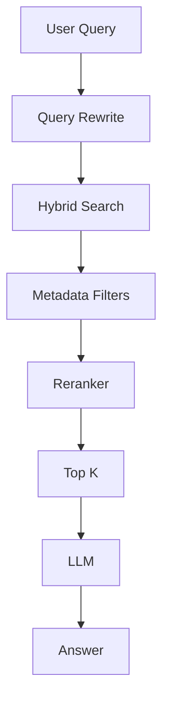

Compared to Naive RAG, several important capabilities are added.

## Query Rewriting

Users often ask vague questions.

Example:

> "What about the refund issue?"

The system may rewrite this as:

> "Explain the company refund policy for failed online transactions."

This dramatically improves retrieval quality.

---

## Hybrid Retrieval

Instead of relying solely on vector search, modern systems combine:

- Dense Retrieval
- BM25
- Metadata Filters

Results are then merged before reranking.

Hybrid retrieval consistently improves recall across both semantic and keyword-heavy queries.

---

## Metadata Filtering

Retrieval should respect business constraints.

Examples:

- Department
- Customer ID
- Product
- Document version
- Language
- Access level
- Tenant

Without metadata filtering, users may receive irrelevant—or unauthorized—results.

---

## Reranking

Vector search retrieves **candidate documents**.

A reranker then scores those candidates more accurately and selects the best ones.

Typical flow:

```text
Retrieve 50

↓

Rerank

↓

Keep Top 5

↓

LLM
```

This approach usually produces much better context while keeping prompt size under control.

---

# Stage 3 — Production RAG

Production systems add operational capabilities beyond retrieval.

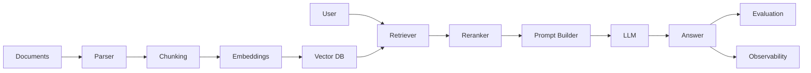

Notice that the LLM is only one service in a larger architecture.

---

# Production Components

| Component | Purpose |
|------------|---------|
| Parser | Extract text from PDFs, DOCX, HTML, Markdown |
| Cleaner | Remove boilerplate, headers, footers |
| Chunker | Split documents into retrievable units |
| Embedder | Convert text into vectors |
| Vector Database | Store embeddings |
| Retriever | Find candidate chunks |
| Metadata Filter | Restrict searchable documents |
| Reranker | Improve relevance |
| Prompt Builder | Assemble context |
| LLM | Generate response |
| Evaluator | Measure answer quality |
| Observability | Monitor latency, cost, failures |

---

# Stage 4 — Agentic RAG

Agentic RAG extends the pipeline by allowing the model to decide how retrieval should occur.

Instead of executing a fixed retrieval sequence, the model can:

- Rewrite queries multiple times
- Search different knowledge bases
- Call external APIs
- Verify intermediate answers
- Decide whether additional retrieval is necessary

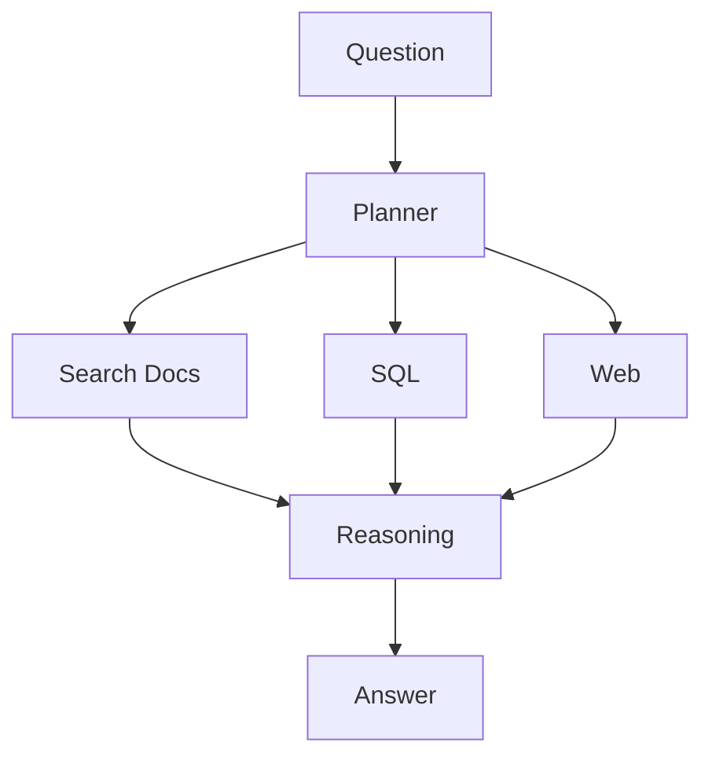

This approach is powerful but introduces additional latency, cost, and complexity.

Use it only when simpler retrieval strategies are insufficient.

---

# Why Demo RAG Systems Fail in Production

Many tutorials stop after embedding a PDF and querying a vector database.

That is only the beginning.

Production systems face additional challenges:

- Incremental document updates
- Millions of chunks
- Multi-tenancy
- Role-based access control
- Cost optimization
- Latency budgets
- Evaluation pipelines
- Monitoring
- Disaster recovery

Ignoring these concerns often leads to brittle systems that perform well in demos but poorly in real-world deployments.

---

# Responsibility Breakdown

One useful mental model is to separate responsibilities.

| Layer | Responsibility |
|---------|---------------|
| Parser | Read documents |
| Chunker | Create meaningful units |
| Embedder | Encode semantics |
| Retriever | Maximize recall |
| Reranker | Improve precision |
| Prompt Builder | Manage context |
| LLM | Reason and generate |
| Evaluator | Measure quality |

Each component should have a single, well-defined responsibility.

---

# Production Anti-Patterns

### ❌ Using only vector search

Hybrid retrieval generally performs better across diverse query types.

---

### ❌ Skipping reranking

Retrieving relevant documents is not enough.

Ordering them correctly is equally important.

---

### ❌ Treating the LLM as a search engine

The retriever finds information.

The LLM explains it.

Confusing these responsibilities usually results in hallucinations.

---

### ❌ Ignoring observability

Without telemetry, you cannot answer questions like:

- Why did latency increase?
- Why are token costs rising?
- Which queries fail retrieval?
- Which documents are never retrieved?

---

# Production Checklist

Before calling your application "production ready", ask yourself:

- [ ] Can documents be updated without rebuilding everything?
- [ ] Can users access only authorized documents?
- [ ] Do you measure Recall@K?
- [ ] Is retrieval hybrid?
- [ ] Do you rerank results?
- [ ] Are prompts observable?
- [ ] Can you trace every answer back to its sources?
- [ ] Can you identify retrieval failures?

---

# Key Takeaways

✅ Naive RAG is excellent for learning but insufficient for production.

✅ Production systems are composed of multiple specialized services.

✅ Retrieval quality is the single biggest factor affecting answer quality.

✅ Hybrid search and reranking are standard techniques in mature RAG systems.

✅ Operational concerns—security, observability, evaluation, and scalability—are just as important as model selection.

---

# Recommended Resources

## Official Documentation

- Azure AI Search – Retrieval-Augmented Generation
- Qdrant Documentation
- Pinecone Learn
- Weaviate Documentation

## YouTube

- Pinecone
- Qdrant
- Weaviate
- LlamaIndex
- Haystack by deepset

## Research Papers

- Retrieval-Augmented Generation for Knowledge-Intensive NLP Tasks (Lewis et al., 2020)
- Dense Passage Retrieval for Open-Domain Question Answering (Karpukhin et al., 2020)

---

➡️ **Next Chapter:** RAG vs Fine-Tuning — Choosing the Right Approach

---
title: Choosing the Right Knowledge Strategy
description: Learn when to use Prompt Engineering, RAG, Fine-Tuning, Function Calling, Databases, or Hybrid Architectures in production AI systems.
author: ChatGPT
version: 1.0
---

# Choosing the Right Knowledge Strategy

> **Target Audience**
>
> Backend Engineers • Platform Engineers • AI Engineers • Solution Architects

---

# Learning Objectives

By the end of this chapter, you will be able to:

- Choose the right architecture for a given AI use case.
- Understand the trade-offs between Prompting, RAG, Fine-Tuning, and Function Calling.
- Avoid common architectural mistakes.
- Explain your design decisions in interviews and system design discussions.

---

# The Most Common Mistake

Many teams start with the wrong question:

> **"Should we use RAG or Fine-Tuning?"**

The better question is:

> **"Where should the required knowledge come from?"**

An LLM application can obtain information from multiple sources:

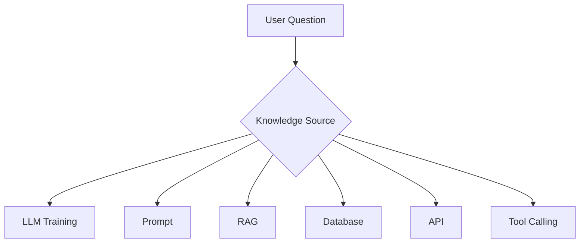

Choosing the right source is often more important than choosing the right model.

---

# Decision Matrix

| Requirement | Prompt | RAG | Fine-Tuning | Function Calling |
|--------------|:------:|:---:|:-----------:|:----------------:|
| Private Documents | ❌ | ✅ | ❌ | ❌ |
| Frequently Updated Knowledge | ❌ | ✅ | ❌ | ✅ |
| Style / Tone | ⚠️ | ❌ | ✅ | ❌ |
| SQL/Data Lookup | ❌ | ❌ | ❌ | ✅ |
| Real-Time Information | ❌ | ⚠️ | ❌ | ✅ |
| Reduce Hallucinations | ⚠️ | ✅ | ❌ | ✅ |
| Deterministic Outputs | ❌ | ⚠️ | ❌ | ✅ |

---

# Option 1 — Prompt Engineering

The simplest solution is often the best.

Instead of adding retrieval or fine-tuning, improve the prompt.

Example:

Instead of

```
Summarize this document.
```

Use

```
Summarize the document in less than 200 words.

Focus on:

- Risks
- Recommendations
- Action Items

Ignore historical information.
```

Prompt engineering is inexpensive, fast to iterate, and should always be your first optimization step.

---

## When Prompt Engineering Is Enough

Use prompt engineering when:

- The model already knows the required knowledge.
- The task is primarily about formatting or style.
- The output structure matters more than new information.
- You need rapid experimentation.

Examples:

- Email generation
- Meeting summaries
- Blog writing
- Grammar correction
- Code explanation
- JSON formatting

---

# Option 2 — Retrieval-Augmented Generation (RAG)

Use RAG when the answer depends on external knowledge that changes over time.

Examples:

- Company documentation
- Product manuals
- Knowledge bases
- Wikis
- Legal policies
- Support tickets
- API documentation

The LLM reasons over retrieved context rather than relying solely on its training data.


---

## Strengths of RAG

- Knowledge can be updated without retraining.
- Answers can include citations.
- Supports private enterprise data.
- Reduces hallucinations by grounding responses.
- Lower operational cost for changing knowledge.

---

## Limitations of RAG

- Retrieval quality determines answer quality.
- Adds latency.
- Requires indexing pipelines.
- Needs evaluation and monitoring.
- More infrastructure than prompting alone.

---

# Option 3 — Fine-Tuning

Fine-tuning modifies the model's behavior by updating its weights using additional training data.

This is **not** the right solution for frequently changing facts.

Instead, use fine-tuning when you want the model to consistently behave differently.

Examples:

- Brand voice
- Domain-specific writing style
- Output formatting
- Classification tasks
- Specialized reasoning patterns

---

## Strengths

- Consistent behavior.
- Lower prompt complexity.
- Can reduce prompt size.
- Useful for repetitive tasks.

---

## Limitations

- Expensive to train.
- Hard to update.
- Does not automatically learn new knowledge.
- Requires high-quality labeled datasets.

---

# Option 4 — Function Calling

Sometimes the correct answer is not in documents.

It's in a live system.

Examples:

- Current order status
- Bank balance
- Flight information
- Inventory
- Weather
- Calendar events

In these cases, the LLM should call a function rather than hallucinate an answer.

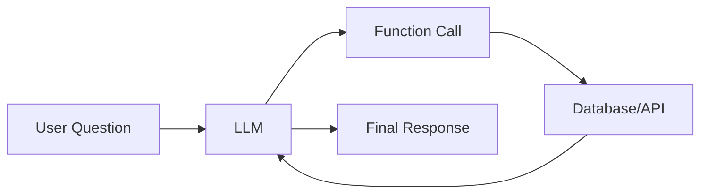

Function calling enables deterministic, real-time interactions with external systems.

---

# Option 5 — Structured Databases

Not every problem requires vector search.

If users ask:

> "How many orders were placed yesterday?"

The correct solution is a SQL query—not RAG.

Use structured databases for:

- Analytics
- Reporting
- Dashboards
- Transactions
- Aggregations
- Exact lookups

RAG complements databases; it does not replace them.

---

# Hybrid Architectures

The most capable production systems combine multiple approaches.

Example:

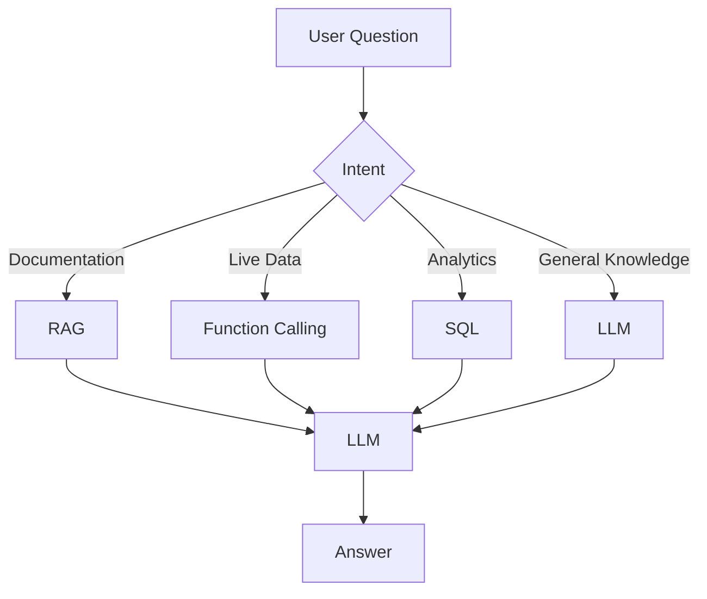

The application routes requests to the most appropriate knowledge source.

---

# Engineering Decision Guide

Use this checklist during system design:

| Question | Recommended Approach |
|-----------|----------------------|
| Does knowledge change daily? | RAG |
| Need current account balance? | Function Calling |
| Want a consistent writing style? | Fine-Tuning |
| Need structured reports? | SQL |
| General reasoning? | Prompt Engineering |

---

# Production War Story

## Problem

A team fine-tuned a model using thousands of internal support articles.

Initially, the chatbot performed well.

Three months later, documentation changed significantly.

The team faced two choices:

- Continue using outdated knowledge.
- Re-train the model.

Both options were costly and slow.

---

## Root Cause

The system stored changing knowledge inside model weights.

Model weights are difficult to update frequently.

---

## Better Solution

Store documentation externally.

Retrieve relevant articles at inference time.

The model remains unchanged while the knowledge base evolves independently.

---

# Common Mistakes

❌ Fine-tuning to teach the model company documentation.

❌ Using RAG for real-time account balances.

❌ Querying vector databases for structured analytics.

❌ Assuming larger context windows eliminate retrieval.

❌ Ignoring simpler solutions like prompt engineering.

---

# Interview Corner

### Question

**Why shouldn't you fine-tune an LLM on frequently changing documentation?**

### Expected Answer

Because fine-tuning stores knowledge in model weights, making updates expensive and slow. RAG separates knowledge from reasoning, allowing documents to change without retraining the model.

---

### Follow-Up

**Can RAG replace databases?**

No.

Databases answer structured queries with deterministic accuracy.

RAG is designed for retrieving unstructured information.

---

# Production Checklist

Before choosing an architecture, ask:

- [ ] Is the knowledge dynamic?
- [ ] Is the data structured or unstructured?
- [ ] Do I need deterministic answers?
- [ ] Will users require citations?
- [ ] Is real-time information necessary?
- [ ] Am I changing knowledge or behavior?

---

# Key Takeaways

- Start with the simplest solution that satisfies your requirements.
- Prompt engineering should be your first optimization step.
- Use RAG for dynamic, unstructured knowledge.
- Use fine-tuning to change behavior, not facts.
- Use function calling for real-time and deterministic operations.
- Hybrid architectures are common in production systems.

---

# Further Reading

## Official Documentation

- OpenAI – Prompt Engineering Guide
- OpenAI – Function Calling Guide
- Azure AI Search – RAG Documentation
- PostgreSQL Documentation

## Research Papers

- Retrieval-Augmented Generation for Knowledge-Intensive NLP Tasks (Lewis et al., 2020)
- Toolformer: Language Models Can Teach Themselves to Use Tools (Schick et al., 2023)

## YouTube

- Andrej Karpathy – Intro to LLMs
- Microsoft Developer – Function Calling
- Pinecone – RAG Deep Dive

---

➡️ **Next Chapter:** LLM Fundamentals for Backend Engineers
---
title: LLM Fundamentals for Backend Engineers
description: Learn the essential LLM concepts required to build production-ready RAG systems without diving into deep ML theory.
author: ChatGPT
version: 1.0
---

# LLM Fundamentals for Backend Engineers

> **Target Audience**
>
> Backend Engineers • Platform Engineers • AI Engineers • Solution Architects

---

# Learning Objectives

By the end of this chapter, you should be able to:

- Understand how LLMs process text.
- Estimate token usage and its impact on cost.
- Design prompts for production systems.
- Understand context windows and their limitations.
- Know when to use function calling.
- Choose an appropriate model for a workload.
- Optimize latency and token costs.

---

# How Much ML Do You Actually Need?

A common misconception is that backend engineers need to understand transformer mathematics before building AI systems.

They don't.

You should invest your learning time where it has the highest engineering payoff.

| Topic | Recommended Depth |
|---------|------------------:|
| Tokens & Tokenization | ⭐⭐⭐⭐⭐ (90%) |
| Context Windows | ⭐⭐⭐⭐☆ (80%) |
| Prompt Engineering | ⭐⭐⭐⭐☆ (80%) |
| Function Calling | ⭐⭐⭐⭐☆ (80%) |
| Structured Outputs | ⭐⭐⭐⭐☆ (75%) |
| Model Selection | ⭐⭐⭐⭐☆ (70%) |
| Attention Mechanism | ⭐⭐☆☆☆ (30%) |
| Transformer Internals | ⭐☆☆☆☆ (20%) |
| Model Training | ⭐☆☆☆☆ (10%) |

> 💡 **Engineering Insight**
>
> In production RAG systems, retrieval quality, prompt construction, and system design have a much greater impact than understanding transformer equations.

---

# How an LLM Processes a Request

An LLM does not read text like a human. Every request follows a pipeline:


Everything the model receives—including your system prompt, retrieved context, tool outputs, and user message—is converted into **tokens**.

---

# Tokens

A token is the smallest unit processed by the model.

A token is **not** always:

- one word
- one character
- one sentence

For example:

| Text | Approximate Tokens |
|------|-------------------:|
| Hello | 1 |
| Backend Engineer | 2–3 |
| `SELECT * FROM users;` | 6–8 |
| Large JSON Response | Hundreds or thousands |

Different models use different tokenizers, so counts may vary slightly.

---

## Why Tokens Matter

Every production metric depends on tokens.

- API cost
- Latency
- Context window usage
- Maximum response length
- Throughput

Example:

```
System Prompt        300 tokens

Retrieved Context   2500 tokens

User Question         50 tokens

Output               500 tokens

-----------------------------

Total               3350 tokens
```

Notice that **retrieved context dominates token usage**.

---

# Context Windows

The context window is the maximum number of tokens the model can consider during a single request.

Think of it as the model's working memory.

```text
System Prompt

↓

Retrieved Documents

↓

Conversation History

↓

Current Question

↓

Generated Answer
```

All of these compete for the same token budget.

---

## Bigger Isn't Always Better

A common misconception:

> "If I have a 1M token context window, I don't need retrieval."

This is incorrect.

Large context windows introduce new challenges:

- Higher latency
- Increased cost
- More irrelevant information
- Attention dilution
- Harder debugging

Production systems should retrieve **only the most relevant information**, regardless of context window size.

---

## Attention Dilution

Imagine asking someone to answer a question after reading:

- 5 pages → manageable
- 500 pages → difficult

LLMs experience a similar effect.

As more irrelevant context is added, the model may struggle to focus on the important information.

This is one reason why effective retrieval often outperforms simply increasing context size.

---

# Prompt Engineering

A production prompt is much more than a single instruction.

A typical prompt includes:

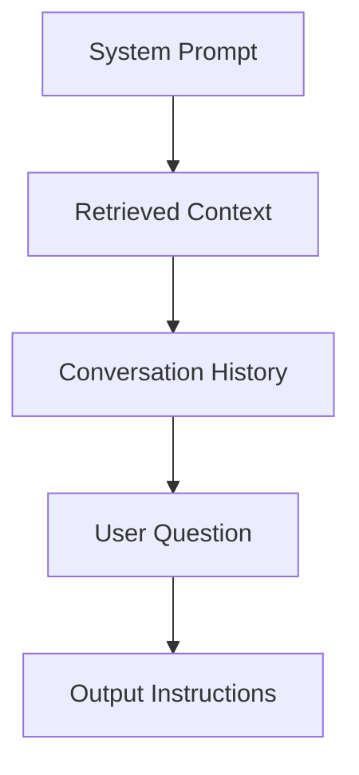

Each section serves a distinct purpose.

---

## System Prompt

Defines the model's role and constraints.

Example:

```text
You are an enterprise documentation assistant.

Answer only using the provided context.

If the answer is unavailable, say so clearly.

Never invent information.
```

The system prompt should be concise, deterministic, and reusable.

---

## Retrieved Context

The retrieval layer provides the evidence.

Example:

```text
Page 42

Refunds are processed within five business days.
```

The LLM reasons over this information rather than relying on memory.

---

## User Question

The user's request should remain separate from system instructions and retrieved context.

Example:

```text
How long does a refund take?
```

---

## Output Instructions

Specify the desired format.

Example:

```text
Return JSON.

Include confidence.

Include citations.
```

Clear formatting instructions reduce post-processing complexity.

---

# Hallucinations

A hallucination occurs when the model generates information that is unsupported or incorrect.

In production RAG systems, hallucinations often stem from retrieval issues rather than model deficiencies.

Common causes:

- Missing relevant chunks
- Incorrect retrieval
- Poor chunking
- Conflicting documents
- Context truncation
- Ambiguous prompts

---

## Reducing Hallucinations

Best practices:

- Use high-quality retrieval.
- Rerank retrieved documents.
- Instruct the model to answer only from provided context.
- Return citations.
- Evaluate answers against a ground-truth dataset.

Remember:

> You cannot prompt your way out of poor retrieval.

---

# Function Calling

LLMs are excellent at reasoning but should not fabricate live information.

Instead, allow them to invoke external tools.

Examples:

- Order status
- Weather
- Calendar
- SQL database
- CRM lookup
- Inventory system

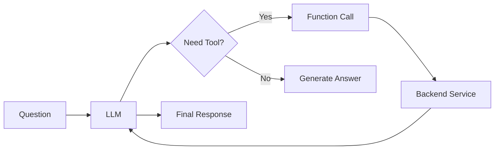

---

## When to Use Function Calling

Use function calling when:

- The answer changes frequently.
- The information is structured.
- The operation must be deterministic.
- The action interacts with an external system.

Examples:

| User Request | Better Solution |
|--------------|-----------------|
| "What's my account balance?" | Function Calling |
| "Summarize this PDF." | RAG |
| "Generate release notes." | Prompt Engineering |
| "How many orders yesterday?" | SQL Tool |

---

# Structured Outputs

Many production systems expect machine-readable responses.

Instead of free-form text:

```text
The order has shipped.
```

Return structured data:

```json
{
  "status": "shipped",
  "estimated_delivery": "2026-08-07",
  "confidence": 0.98
}
```

Structured outputs simplify downstream integrations and reduce parsing errors.

---

# Choosing the Right Model

Model selection involves balancing:

- Quality
- Latency
- Cost
- Context size

Example considerations:

| Requirement | Preferred Model Characteristics |
|-------------|---------------------------------|
| Interactive chat | Low latency |
| Complex reasoning | High capability |
| Batch summarization | Low cost |
| Long documents | Large context window |

Avoid choosing the largest model by default; benchmark against your actual workload.

---

# Cost Optimization

Token usage directly impacts operational cost.

Common optimizations:

- Retrieve fewer but higher-quality chunks.
- Compress conversation history.
- Cache frequent responses.
- Reuse embeddings.
- Use smaller models for simpler tasks.
- Stream responses when appropriate.

A small reduction in average prompt size can significantly reduce monthly API costs at scale.

---

# Production Checklist

Before deploying an LLM-powered feature:

- [ ] Count tokens in every request.
- [ ] Measure latency by stage.
- [ ] Set output token limits.
- [ ] Use structured outputs where possible.
- [ ] Add retry logic for transient failures.
- [ ] Log prompts securely (redacting sensitive data).
- [ ] Monitor API cost.
- [ ] Track model versions.

---

# Common Mistakes

❌ Sending entire documents to the model.

❌ Ignoring token costs.

❌ Mixing instructions with retrieved context.

❌ Expecting the LLM to know live information.

❌ Not validating structured outputs.

❌ Assuming larger context windows eliminate retrieval.

---

# Interview Corner

### Q1: Why doesn't a 1M-token context window replace RAG?

**Answer:** Large context windows increase cost and latency, and too much irrelevant information can reduce answer quality. Retrieval remains necessary to provide focused, relevant context.

---

### Q2: When should you use function calling instead of RAG?

**Answer:** Use function calling when the required information is structured, real-time, or deterministic (e.g., account balances, order status, weather). Use RAG for unstructured knowledge such as documentation or policies.

---

### Q3: Why are tokens important?

**Answer:** Tokens determine API cost, latency, context usage, and output limits. Efficient token management is a key part of operating production LLM systems.

---

# Summary

- LLMs operate on tokens, not words.
- Token usage drives cost and latency.
- Larger context windows complement—but do not replace—retrieval.
- Well-structured prompts improve consistency and reduce post-processing.
- Function calling is the preferred approach for live, structured data.
- Structured outputs simplify integration with downstream services.

---

# Recommended Resources

## Official Documentation

- OpenAI API Documentation
- Anthropic Documentation
- Google Gemini Documentation
- Azure OpenAI Documentation

## Research Papers

- Attention Is All You Need (Vaswani et al., 2017)
- Toolformer: Language Models Can Teach Themselves to Use Tools (Schick et al., 2023)

## YouTube

- Andrej Karpathy – Intro to Large Language Models
- OpenAI Developers
- Microsoft Developer
- Anthropic Engineering

---

➡️ **Next Chapter:** Embeddings — The Foundation of Semantic Search
---
title: Embeddings Fundamentals
description: Understanding embeddings from an engineering perspective.
author: ChatGPT
version: 1.0
---

# Embeddings Fundamentals

> **Target Audience**
>
> Backend Engineers • Platform Engineers • AI Engineers • Solution Architects

---

# Learning Objectives

By the end of this chapter you'll understand:

- What embeddings actually are
- Why embeddings are the foundation of RAG
- How LLMs "understand" similarity
- What an embedding vector represents
- Why semantic search works
- Why embeddings are not magic
- Engineering intuition behind embedding spaces

---

# Why Embeddings Exist

Let's start with a problem.

Suppose your documentation contains this sentence:

> **Customers can reset their password from the profile settings page.**

Now a user asks:

> **How do I change my login credentials?**

Notice something.

None of the important words match.

| Document | Query |
|----------|-------|
| password | login credentials |
| reset | change |

Traditional keyword search struggles here.

Yet as humans we instantly understand they're asking about the same thing.

How?

Because we understand **meaning**, not words.

Embeddings allow computers to do something similar.

---

# What Is an Embedding?

An embedding is a numerical representation of data that preserves semantic meaning.

Instead of storing text like this

```
Reset your password.
```

the model converts it into something like

```
[0.42,
-0.18,
0.73,
...
-0.91]
```

This list of numbers is called an **embedding vector**.

---

## Important

These numbers have **no individual meaning**.

You cannot inspect

```
0.42
```

and say

> "This represents passwords."

Meaning comes from the **relationship between vectors**, not individual values.

This is one of the biggest conceptual shifts for engineers new to embeddings.

---

# The Embedding Space

Imagine every document becomes a point inside a gigantic multi-dimensional space.

Instead of thinking in thousands of dimensions, imagine only two.

```
                Password Reset

                     ●

            ●
Login Help

                           ●
Change Credentials


--------------------------------------------

               Pizza Recipe


                           ●
Chocolate Cake
```

Related concepts naturally cluster together.

Unrelated concepts end up far apart.

Real embedding models use hundreds or thousands of dimensions instead of two.

---

# Semantic Meaning

The remarkable property of embeddings is that **similar meanings are placed close together**.

Example:

```
Reset Password

↓

Change Password

↓

Forgot Password

↓

Recover Account
```

All of these appear near each other.

Meanwhile

```
Pizza

↓

Football

↓

Stock Market
```

appear elsewhere.

The embedding model has learned these relationships from massive amounts of text during training.

---

# Why Does This Work?

Modern embedding models are trained so that similar pieces of text produce similar vectors.

Conceptually:

```
Sentence A

↓

Embedding Model

↓

Vector A


Sentence B

↓

Embedding Model

↓

Vector B
```

If the meanings are similar,

```
Distance(Vector A, Vector B)
```

is small.

If the meanings differ,

the distance becomes larger.

The retrieval system simply searches for the nearest vectors.

---

# Embeddings Are NOT Compression

A common misconception is:

> "Embeddings compress text."

Not exactly.

They're not trying to preserve every word.

They're trying to preserve **meaning**.

For example:

```
The meeting starts at 10 AM.
```

and

```
Our meeting begins at ten o'clock.
```

produce very similar embeddings despite using different words.

---

# Embeddings Are NOT Encryption

Another misconception.

The embedding vector is **not encrypted text**.

You cannot reconstruct the original document from its embedding.

An embedding captures semantic information, not a reversible encoding.

---

# The Retrieval Pipeline

In a RAG system, embeddings are generated twice.

## During Indexing

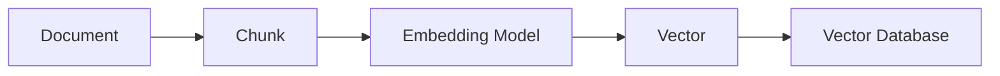

Each chunk is converted into a vector and stored.

---

## During Query Time


Notice something important.

The **same embedding model** should be used for both indexing and querying.

We'll discuss why later.

---

# An Engineering Analogy

Think of embeddings like GPS coordinates.

Suppose every document has a location.

```
Password Help

↓

(18.2, 74.1)

Account Recovery

↓

(18.4, 74.3)

Chocolate Cake

↓

(-53.8, 140.9)
```

When a query arrives,

we simply ask

> "Which documents are closest?"

Vector databases are optimized to answer exactly this question.

---

# Similarity Instead of Equality

Traditional databases ask

```
WHERE title = "Password"
```

Embeddings ask

```
Which document is MOST SIMILAR?
```

That subtle difference is what enables semantic search.

---

# Why Backend Engineers Should Care

Most retrieval quality problems originate here.

Poor embeddings lead to:

- irrelevant documents
- missing documents
- hallucinations
- low Recall@K
- poor reranker performance

Changing your LLM rarely fixes these issues.

---

# Embedding Dimensions

Every embedding model produces vectors of a fixed size.

Examples:

| Model | Dimensions |
|--------|-----------:|
| text-embedding-3-small | 1536 |
| text-embedding-3-large | 3072 |
| BGE Large | 1024 |
| E5 Large | 1024 |

Higher dimensions can capture richer semantic relationships, but they also increase:

- storage requirements
- memory usage
- indexing time
- retrieval latency

Bigger is **not always better**.

Choose a model based on retrieval quality, cost, and operational constraints—not dimension count alone.

---

# Do Similar Documents Always Stay Together?

Mostly.

But embeddings are not perfect.

Example:

```
Apple (Fruit)

Apple (Company)
```

Depending on the surrounding context, the embedding model may place these near different neighborhoods.

Context matters.

This is one reason why chunk quality and surrounding text are so important.

---

# Production Insight

A surprising fact:

Changing from one modern embedding model to another often gives only modest improvements.

Changing from **bad chunking to good chunking** can dramatically improve retrieval quality.

Many production teams spend weeks benchmarking embedding models while overlooking chunking strategy.

---

# Common Misconceptions

### ❌ Better embeddings eliminate hallucinations

No.

Hallucinations can still occur because of:

- missing documents
- poor prompts
- conflicting sources
- context truncation
- model behavior

Embeddings improve retrieval—not reasoning.

---

### ❌ Embeddings understand facts

No.

They capture semantic similarity.

They do not verify correctness.

---

### ❌ Embeddings replace databases

No.

Embeddings complement structured databases.

Use vector search for semantic similarity.

Use SQL for exact lookups and aggregations.

---

# Production War Story

## Problem

A team upgraded to a larger embedding model expecting retrieval quality to improve.

Nothing changed.

## Investigation

Metrics showed:

- Recall@10 remained unchanged.
- Precision remained unchanged.
- Latency increased.
- Storage costs doubled.

## Root Cause

The issue wasn't the embedding model.

The documents had been chunked into 4,000-token blocks.

Relevant information was buried inside enormous chunks.

The retriever found the correct chunk, but the LLM couldn't easily identify the relevant passage.

## Solution

The team:

- reduced chunk size,
- added overlap,
- introduced reranking.

Retrieval quality improved significantly without changing the embedding model.

**Lesson:** Optimize your data pipeline before changing models.

---

# Production Checklist

Before selecting an embedding model:

- [ ] Do I understand my document types?
- [ ] Have I designed an appropriate chunking strategy?
- [ ] Is multilingual support required?
- [ ] Do I need domain-specific embeddings?
- [ ] Have I benchmarked retrieval quality?
- [ ] Can I afford re-indexing if I switch models?

---

# Interview Corner

### Q1

**Why can't a vector database search raw text directly?**

**Answer:**

Vector databases operate on numerical vectors. Documents must first be converted into embeddings so semantic similarity can be computed efficiently.

---

### Q2

**Why should the same embedding model be used during indexing and querying?**

**Answer:**

Because the embedding space is model-specific. Indexing with one model and querying with another can place semantically identical text in different regions of the vector space, leading to poor retrieval quality.

---

### Q3

**What usually has a larger impact on retrieval quality: changing embedding models or improving chunking?**

**Answer:**

Improving chunking often has a larger impact because it determines the granularity and relevance of the retrieved context. Modern embedding models are generally strong; poor chunking can negate their advantages.

---

# Summary

- Embeddings represent semantic meaning as numerical vectors.
- Similar meanings occupy nearby regions in vector space.
- Retrieval relies on finding the nearest vectors, not matching keywords.
- Embeddings are foundational to semantic search but are only one part of a successful RAG system.
- Data quality and chunking often matter more than switching embedding models.

---

# Recommended Resources

## Official Documentation

- OpenAI Embeddings Guide
- Sentence Transformers Documentation
- Voyage AI Documentation
- Jina AI Embeddings
- Nomic Embed Documentation

## Research Papers

- Dense Passage Retrieval for Open-Domain Question Answering (Karpukhin et al., 2020)
- Contriever: Unsupervised Dense Information Retrieval

## YouTube

- Pinecone – Embeddings Explained
- Qdrant – Vector Embeddings
- Weaviate – Semantic Search Fundamentals

---

➡️ **Next Chapter:** Similarity Search — Cosine Similarity, Dot Product, Euclidean Distance, and Why Vector Search Works

---
title: Similarity Search
description: Understanding similarity metrics, nearest neighbor search, and why Approximate Nearest Neighbor (ANN) algorithms are essential for production RAG systems.
author: ChatGPT
version: 1.0
---

# Similarity Search

> **Target Audience**
>
> Backend Engineers • Platform Engineers • AI Engineers • Solution Architects

---

# Learning Objectives

By the end of this chapter, you should be able to:

- Understand how similarity search works.
- Differentiate between cosine similarity, dot product, and Euclidean distance.
- Explain why vector databases use Approximate Nearest Neighbor (ANN) search.
- Understand Top-K retrieval.
- Choose an appropriate similarity metric.
- Debug retrieval quality issues related to vector search.

---

# From Keyword Search to Semantic Search

Traditional search engines answer:

> "Does this document contain the same words?"

Semantic search answers:

> "Does this document mean the same thing?"

Example:

Document:

> Password Reset Guide

Query:

> How do I recover my account?

Keyword search:

❌ No match

Semantic search:

✅ High similarity

This ability comes from comparing **embedding vectors**, not raw text.

---

# Embedding Space Refresher

Recall that embeddings place semantically similar text close together in a high-dimensional space.

Imagine a simplified 2D representation:

```text
          Login Help ●

                  ● Password Reset

                         ● Change Credentials


-------------------------------------------


         Chocolate Cake ●

                 ● Pizza Recipe
```

Nearby vectors are likely to describe similar concepts.

---

# What Is Similarity?

Suppose we have:

```
Query

↓

[0.14, 0.77, -0.22, ...]
```

and millions of document vectors.

The retrieval engine asks:

> Which vectors are closest to the query vector?

The answer becomes the context passed to the LLM.

---

# Similarity Metrics

There are three commonly used similarity metrics.

## 1. Cosine Similarity

The most widely used metric for semantic search.

Instead of comparing absolute values, cosine similarity compares the **angle** between two vectors.

```text
          Document A

             ↗

            /

           /

Query →

           \

            \

             ↘

          Document B
```

If the vectors point in nearly the same direction, their cosine similarity is high.

### Formula

```text
cos(A,B) = (A · B) / (|A| × |B|)
```

You don't need to memorize the equation.

The intuition is more important:

- Same direction → High similarity
- Opposite direction → Low similarity
- Orthogonal vectors → Little semantic relationship

---

### Advantages

- Ignores vector magnitude.
- Robust across embedding models.
- Standard choice for semantic retrieval.

---

### When to Use

✅ General RAG

✅ Document search

✅ Knowledge bases

✅ FAQ systems

---

# 2. Dot Product

Dot product considers both:

- Direction
- Magnitude

This is often used by models trained specifically for dot-product similarity.

Unlike cosine similarity, longer vectors can receive higher scores.

### Advantages

- Fast
- Supported by many embedding models
- Used in several ANN libraries

### Limitations

Performance depends on how the embedding model was trained.

Always check the model's recommended similarity metric.

---

# 3. Euclidean Distance

Instead of comparing direction, Euclidean distance measures the straight-line distance between vectors.

```text
Document A ●

          \
           \
            \
             \
              ● Query
```

Smaller distance means greater similarity.

---

### Advantages

Simple and intuitive.

### Limitations

Less common for modern semantic search because vector magnitude can distort results.

---

# Which Metric Should You Choose?

| Metric | Typical Use Case | Recommended |
|---------|------------------|-------------|
| Cosine Similarity | Semantic Search | ⭐⭐⭐⭐⭐ |
| Dot Product | Model-specific retrieval | ⭐⭐⭐⭐☆ |
| Euclidean Distance | Classical ML | ⭐⭐☆☆☆ |

---

# Top-K Retrieval

The retriever rarely returns a single document.

Instead, it returns the **K most similar** chunks.

Example:

```
Top 5

↓

Chunk 18

Chunk 91

Chunk 44

Chunk 73

Chunk 60
```

These candidates are then passed to a reranker or directly to the LLM.

---

## Choosing K

Choosing K is a trade-off.

Small K:

- Lower latency
- Lower cost
- Risk of missing relevant information

Large K:

- Better recall
- Higher latency
- More prompt tokens
- More irrelevant context

Typical starting values:

| Stage | K |
|---------|--:|
| Initial Retrieval | 20–100 |
| After Reranking | 5–10 |
| Final Context | 3–8 |

These are starting points—always benchmark against your own corpus.

---

# Exact Nearest Neighbor Search

The simplest algorithm compares the query vector with **every vector**.

```text
Query

↓

Compare with Doc 1

↓

Compare with Doc 2

↓

Compare with Doc 3

↓

...

↓

Compare with Doc 10,000,000
```

This guarantees the correct answer.

Unfortunately, it does not scale.

---

## Time Complexity

If you have:

- 10 million vectors
- 1,536 dimensions
- Hundreds of queries per second

Comparing every vector becomes computationally expensive.

Latency quickly becomes unacceptable.

---

# Approximate Nearest Neighbor (ANN)

Instead of finding the mathematically perfect nearest neighbor, ANN finds one that is **extremely close** while being dramatically faster.

Think of it like GPS navigation.

Finding the absolute shortest route might take significant computation.

Finding a route that's 99.9% as good is often much faster—and practically indistinguishable.

The same idea applies to vector search.

---

## ANN Trade-Off

```text
Higher Accuracy
      ▲
      │
      │
      │
      │
      └────────────► Higher Speed
```

You rarely need perfect accuracy.

You need high recall with low latency.

---

# Why ANN Works Well for RAG

RAG does not require the single mathematically closest vector.

It needs several highly relevant documents.

If the retriever finds:

```
98% correct

instead of

100% correct
```

the LLM often produces the same answer.

This makes ANN an excellent engineering trade-off.

---

# Engineering Insight

Vector databases are optimized for:

- Fast retrieval
- High recall
- Low latency

They intentionally sacrifice a tiny amount of accuracy to achieve orders-of-magnitude performance improvements.

This is why ANN algorithms dominate production systems.

---

# Common Retrieval Pipeline


Notice that ANN is only one stage in the pipeline.

---

# Common Mistakes

❌ Comparing vectors using the wrong similarity metric.

❌ Returning hundreds of chunks directly to the LLM.

❌ Skipping reranking.

❌ Assuming ANN always returns the mathematically closest vector.

❌ Optimizing ANN parameters before measuring retrieval quality.

---

# Production War Story

## Problem

A team increased Top-K from 10 to 100, expecting better answers.

Instead:

- Latency doubled.
- Token costs tripled.
- Hallucinations increased.

## Investigation

The retriever was returning many loosely related chunks.

The LLM became distracted by irrelevant context.

## Solution

- Reduced initial Top-K.
- Added a cross-encoder reranker.
- Limited final context to 6 chunks.

Answer quality improved while reducing both cost and latency.

**Lesson:** More context is not always better. High-quality context consistently outperforms large quantities of mediocre context.

---

# Production Checklist

Before tuning similarity search:

- [ ] Is the similarity metric appropriate for the embedding model?
- [ ] Is Top-K benchmarked?
- [ ] Is ANN recall measured?
- [ ] Are retrieved chunks reranked?
- [ ] Is retrieval latency monitored?
- [ ] Is prompt size tracked?

---

# Interview Corner

### Q1

**Why is cosine similarity commonly used for semantic search?**

**Answer:**

Because it compares vector direction rather than magnitude, making it well suited for measuring semantic similarity across embeddings.

---

### Q2

**Why don't vector databases compare every vector?**

**Answer:**

Exact nearest neighbor search scales poorly for millions of vectors. Approximate Nearest Neighbor (ANN) algorithms provide much lower latency while maintaining high recall.

---

### Q3

**Why doesn't increasing Top-K always improve answer quality?**

**Answer:**

Larger Top-K increases prompt size and introduces irrelevant context, which can reduce the model's ability to focus on the most relevant evidence.

---

# Summary

- Similarity search retrieves semantically related documents rather than exact keyword matches.
- Cosine similarity is the most common metric for production RAG.
- ANN algorithms enable low-latency search across millions of vectors.
- Top-K is a tunable parameter that balances recall, latency, and cost.
- Retrieval quality depends on the entire pipeline—not just the similarity metric.

---

# Recommended Resources

## Official Documentation

- FAISS Documentation
- HNSW Paper
- Qdrant Documentation
- Pinecone Learn

## Research Papers

- Efficient and Robust Approximate Nearest Neighbor Search Using HNSW (Malkov & Yashunin, 2018)
- FAISS: A Library for Efficient Similarity Search (Johnson et al., 2017)

## YouTube

- Pinecone – Similarity Search Explained
- Qdrant – ANN and HNSW
- Weaviate – Vector Search Fundamentals

---

➡️ **Next Chapter:** Approximate Nearest Neighbor (ANN), HNSW, IVF, and why modern Vector Databases can search billions of vectors in milliseconds.

---
title: Approximate Nearest Neighbor (ANN) & HNSW
description: Learn how modern vector databases retrieve millions of embeddings in milliseconds using Approximate Nearest Neighbor search and the Hierarchical Navigable Small World (HNSW) algorithm.
author: ChatGPT
version: 1.0
---

# Approximate Nearest Neighbor (ANN) & HNSW

> **Target Audience**
>
> Backend Engineers • Platform Engineers • AI Engineers • Solution Architects

---

# Learning Objectives

After this chapter, you should understand:

- Why brute-force vector search doesn't scale
- What Approximate Nearest Neighbor (ANN) search is
- How HNSW works internally
- The meaning of HNSW parameters (`M`, `efConstruction`, `efSearch`)
- When HNSW is the right index choice
- Common production tuning strategies

---

# The Scaling Problem

Imagine your vector database stores:

- 50 million document chunks
- 1,536-dimensional embeddings
- Thousands of search requests per second

A naive approach would compare every query vector with every stored vector.

```text
Query

↓

Doc 1

↓

Doc 2

↓

Doc 3

↓

...

↓

Doc 50,000,000
```

This is **Exact Nearest Neighbor (ENN)** search.

While perfectly accurate, it becomes prohibitively slow at scale.

---

# Approximate Nearest Neighbor (ANN)

ANN algorithms make a deliberate trade-off:

> Find a *very good* answer much faster than the mathematically perfect answer.

Think of Google Maps.

You don't care whether your route is the absolute shortest by 3 meters—you care that it gets you there quickly.

Vector search works the same way.

A retrieval accuracy of **99%** with a latency of **20 ms** is often far more valuable than **100%** accuracy at **2 seconds**.

---

# Types of ANN Algorithms

Several ANN indexing strategies exist.

| Algorithm | Strengths | Weaknesses |
|------------|-----------|------------|
| HNSW | Excellent recall, low latency | High RAM usage |
| IVF | Lower memory footprint | Lower recall without tuning |
| PQ (Product Quantization) | Compresses vectors | Reduced precision |
| ScaNN | Optimized for TPU/CPU workloads | Ecosystem-specific |
| DiskANN | Optimized for SSD-scale datasets | More complex deployment |

Today, **HNSW is the default choice** for many production vector databases.

---

# What Is HNSW?

HNSW stands for:

> **Hierarchical Navigable Small World**

Despite the intimidating name, the core idea is intuitive.

Instead of checking every vector, HNSW builds a graph where each vector is connected to a small number of nearby vectors.

Searching becomes a graph traversal rather than a full scan.

---

# Intuition: A Road Network

Imagine cities connected by roads.

```
Delhi ----- Lucknow ----- Varanasi
   |             |
Jaipur       Prayagraj
```

To reach Prayagraj from Delhi, you don't inspect every city in India.

You follow roads that progressively move you closer.

HNSW works similarly.

Each vector points to neighboring vectors, allowing efficient navigation.

---

# Graph Representation

Each node represents an embedding.

```text
        ●
      / | \
     ●  ●  ●
    / \ | / \
   ●---●---●
      \ | /
       ●
```

Edges connect semantically similar vectors.

When a query arrives, the search algorithm walks the graph toward increasingly similar nodes.

---

# Why "Hierarchical"?

HNSW organizes nodes into multiple layers.

```text
Layer 3       ●

             / \
Layer 2    ●---●---●

           /|\ /|\ /|\
Layer 1  ●-●-●-●-●-●-●

          Dense Bottom Layer
```

Each higher layer contains fewer nodes.

Think of it like:

- **Top layer:** Highways (fast, coarse navigation)
- **Middle layers:** Major roads
- **Bottom layer:** Local streets (fine-grained search)

The search starts at the top and progressively descends to more detailed layers.

This dramatically reduces the search space.

---

# HNSW Search Process

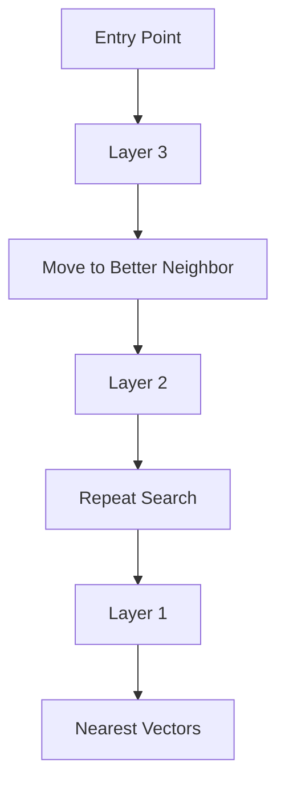

Instead of exploring the entire graph, the algorithm greedily moves toward better candidates.

---

# HNSW Parameters

Most vector databases expose three key tuning parameters.

Understanding them is more valuable than memorizing implementation details.

---

## 1. M

`M` controls the maximum number of neighbors each node stores.

Example:

```
M = 4

       ●
     / | \
    ●  ●  ●
     \ |
      ●
```

Larger `M` means:

- Better connectivity
- Higher recall
- More memory usage
- Longer index build time

Smaller `M` means:

- Lower RAM usage
- Faster index creation
- Reduced search quality

Typical values:

- 16
- 32
- 48

---

## 2. efConstruction

Used **only during index creation**.

It controls how many candidate neighbors are evaluated before final graph connections are chosen.

Higher values:

✅ Better graph quality

✅ Higher recall

❌ Slower indexing

❌ More CPU usage

Typical values:

100–400

---

## 3. efSearch

Used **during query execution**.

Controls how many candidate nodes are explored before returning results.

Low values:

- Faster search
- Lower recall

High values:

- Better recall
- Higher latency

Think of it as:

> "How thoroughly should I explore the graph before stopping?"

Typical production range:

50–200

---

# Parameter Trade-offs

| Parameter | Improves | Cost |
|------------|----------|------|
| M | Recall | RAM, Index Build Time |
| efConstruction | Index Quality | Build Time |
| efSearch | Recall | Query Latency |

These parameters should be tuned using benchmarks rather than intuition.

---

# Why HNSW Is Fast

A brute-force search is approximately:

```
O(N)
```

where `N` is the number of vectors.

HNSW dramatically reduces the number of vectors visited by navigating the graph intelligently.

While the exact complexity depends on implementation and data distribution, HNSW achieves **sub-linear search behavior in practice**, making it suitable for very large datasets.

---

# Memory Trade-offs

The graph structure itself consumes memory.

Each node stores:

- Embedding vector
- Metadata
- Neighbor links

Increasing `M` increases the number of stored edges.

As a result, HNSW often uses more RAM than IVF-based indexes.

---

# When Should You Use HNSW?

HNSW is an excellent default when:

- Low-latency search is required.
- High recall matters.
- The dataset fits comfortably in memory.
- Reads greatly outnumber writes.

Common use cases:

- Enterprise documentation
- Internal knowledge bases
- Semantic search
- Code search
- Customer support bots

---

# When HNSW May Not Be Ideal

Consider alternatives when:

- The dataset is too large to fit in memory.
- You need extremely high ingestion rates.
- Storage cost is a primary concern.
- Disk-based indexes are preferable.

In these scenarios, IVF, Product Quantization (PQ), or DiskANN may be better choices.

---

# Production Architecture

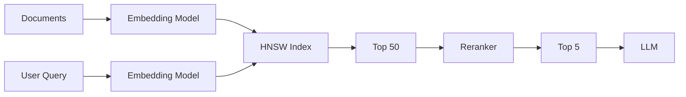

Notice that HNSW is responsible only for efficient candidate retrieval.

Relevance is further improved by reranking.

---

# Common Mistakes

❌ Setting `efSearch` extremely high without measuring latency.

❌ Increasing `M` without considering RAM usage.

❌ Assuming HNSW guarantees exact nearest neighbors.

❌ Benchmarking only latency and ignoring recall.

❌ Rebuilding indexes during peak production traffic.

---

# Production War Story

## Problem

A team doubled `efSearch` from 64 to 256 after reading that "higher recall is always better."

The result:

- Query latency increased from 35 ms to 140 ms.
- API throughput dropped significantly.
- Recall improved by less than 1%.

## Root Cause

The retriever was already returning highly relevant candidates.

Additional graph exploration produced diminishing returns while increasing CPU usage.

## Resolution

The team:

- Reduced `efSearch` back to 64.
- Added a reranker.
- Focused on improving chunk quality instead.

They achieved better answer quality with lower latency.

**Lesson:** Tune the entire retrieval pipeline, not just the ANN index.

---

# Production Checklist

Before deploying HNSW:

- [ ] Measure Recall@K and latency together.
- [ ] Benchmark `M`, `efConstruction`, and `efSearch`.
- [ ] Estimate RAM usage before indexing.
- [ ] Monitor index build duration.
- [ ] Plan index rebuilds to avoid production impact.
- [ ] Validate retrieval quality after parameter changes.

---

# Interview Corner

### Q1

**Why is HNSW faster than brute-force search?**

**Answer:**

HNSW organizes vectors into a multi-layer graph and traverses only promising neighbors, avoiding comparisons against every vector.

---

### Q2

**What does `efSearch` control?**

**Answer:**

It determines how many candidate nodes are explored during search. Higher values generally improve recall but increase query latency.

---

### Q3

**Why doesn't increasing `M` always improve production performance?**

**Answer:**

While larger `M` improves graph connectivity and recall, it also increases RAM usage, index size, and build time. The optimal value depends on workload and infrastructure constraints.

---

# Summary

- ANN algorithms trade a small amount of accuracy for dramatically lower latency.
- HNSW is a graph-based ANN index used by many production vector databases.
- `M`, `efConstruction`, and `efSearch` are the primary tuning parameters.
- Benchmark recall and latency together; optimizing one in isolation can hurt overall system performance.
- HNSW is an excellent default for many RAG workloads but is not universally optimal.

---

# Recommended Resources

## Official Documentation

- Qdrant HNSW Guide
- Weaviate HNSW Documentation
- Milvus Index Documentation
- pgvector HNSW Index Documentation

## Research Papers

- Efficient and Robust Approximate Nearest Neighbor Search Using Hierarchical Navigable Small World Graphs (Malkov & Yashunin, 2018)
- FAISS: A Library for Efficient Similarity Search

## YouTube

- Qdrant – HNSW Explained
- Pinecone – ANN Deep Dive
- Weaviate – Vector Indexing

---

➡️ **Next Chapter:** Vector Databases — pgvector vs Qdrant vs Pinecone vs Weaviate vs Milvus: Architecture, Trade-offs, and Choosing the Right Database

---
title: Vector Databases
description: Architecture, trade-offs, and selecting the right vector database for production RAG systems.
author: ChatGPT
version: 1.0
---

# Vector Databases

> **Target Audience**
>
> Backend Engineers • Platform Engineers • AI Engineers • Solution Architects

---

# Learning Objectives

After completing this chapter, you'll understand:

- What a vector database actually does
- Why PostgreSQL alone isn't enough for semantic search
- How vector databases differ from traditional databases
- When to choose pgvector, Qdrant, Pinecone, Weaviate, or Milvus
- How metadata filtering works
- Production design considerations

---

# Why Do We Need a Vector Database?

Imagine your application stores one million documentation chunks.

Each chunk has:

- Text
- Metadata
- Embedding (1536 dimensions)

Example:

```json
{
  "id": 1021,
  "text": "Users can reset passwords...",
  "embedding": [...1536 numbers...],
  "metadata": {
    "department": "Support",
    "language": "en",
    "version": "v3"
  }
}
```

Now the user asks:

> "How do I recover my account?"

Your system must:

1. Convert the query into an embedding.
2. Find the most similar vectors.
3. Return results in milliseconds.

A traditional relational database is optimized for **exact matches**, joins, and aggregations—not high-dimensional nearest-neighbor search.

---

# Traditional Database vs Vector Database

| Feature | PostgreSQL | Vector Database |
|----------|------------|-----------------|
| Exact Match | ✅ | ✅ |
| Joins | ✅ | Limited |
| Aggregations | ✅ | Limited |
| Semantic Search | ❌ | ✅ |
| ANN Indexes | ❌ (without extensions) | ✅ |
| Metadata Filtering | ✅ | ✅ |
| Vector Search | Extension required | Native |

A vector database specializes in one thing:

> **Fast similarity search over high-dimensional vectors.**

---

# High-Level Architecture

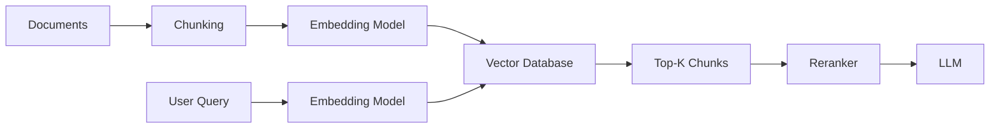

Notice that the vector database is only one component in the retrieval pipeline.

---

# What Does a Vector Database Store?

A record typically contains three parts:

```text
+---------------------------+
| Embedding Vector          |
+---------------------------+
| Original Text             |
+---------------------------+
| Metadata                  |
+---------------------------+
```

### Embedding

Used for similarity search.

### Text

Returned to the LLM after retrieval.

### Metadata

Used for filtering and access control.

---

# Metadata Filtering

Imagine your organization stores documents for multiple departments:

```
Engineering

Finance

Legal

Support

Sales
```

If a support engineer searches for "refund policy", you probably don't want legal documents about mergers appearing in the results.

Metadata allows you to narrow the search before or during vector retrieval.

Example filters:

- Department
- Tenant
- Language
- Product
- Version
- Access level
- Region

Example:

```text
department = "Support"

AND

language = "en"
```

Filtering improves both relevance and security.

---

# Hybrid Retrieval

Modern production systems rarely rely on vector search alone.

Instead, they combine:

- Semantic search (embeddings)
- Keyword search (BM25)
- Metadata filtering

```mermaid
flowchart TD

A[User Query]

A --> B[BM25 Search]

A --> C[Vector Search]

B --> D[Merge Results]

C --> D

D --> E[Reranker]

E --> F[LLM]
```

This approach improves recall, especially for:

- Error codes
- API names
- Product SKUs
- Function names
- IDs

---

# Comparing Popular Vector Databases

## 1. pgvector

pgvector is a PostgreSQL extension that adds vector storage and similarity search.

### Advantages

- Uses existing PostgreSQL infrastructure.
- ACID transactions.
- SQL support.
- Easy backups.
- Simple operations.
- Excellent for teams already running PostgreSQL.

### Limitations

- Not designed for extremely large vector workloads.
- Horizontal scaling is more complex than purpose-built vector databases.
- Fewer vector-specific features.

### Best For

- Internal tools
- Small-to-medium RAG systems
- Existing PostgreSQL deployments
- Teams minimizing operational complexity

---

## 2. Qdrant

Qdrant is an open-source vector database focused on production retrieval.

### Advantages

- Native HNSW implementation.
- Rich metadata filtering.
- Payload indexing.
- REST and gRPC APIs.
- Easy self-hosting.
- Excellent documentation.

### Best For

- Enterprise RAG
- Knowledge bases
- Self-hosted deployments
- Backend teams wanting operational control

---

## 3. Pinecone

Pinecone is a fully managed vector database service.

### Advantages

- No infrastructure management.
- Automatic scaling.
- High availability.
- Fast onboarding.

### Limitations

- Managed service costs.
- Less infrastructure control.
- Vendor dependency.

### Best For

- SaaS products
- Startups
- Teams without dedicated infrastructure engineers

---

## 4. Weaviate

Weaviate combines vector search with a graph-inspired data model.

### Advantages

- Hybrid search.
- Schema support.
- Rich filtering.
- Multiple embedding integrations.
- Open source.

### Best For

- Semantic applications
- Knowledge graphs
- Multi-modal search

---

## 5. Milvus

Milvus is designed for large-scale vector search.

### Advantages

- Distributed architecture.
- Multiple ANN indexes.
- GPU acceleration.
- Massive scalability.

### Trade-Offs

- More operational complexity.
- Steeper learning curve.

### Best For

- Large enterprise deployments
- AI platforms
- Billion-scale vector collections

---

# Feature Comparison

| Feature | pgvector | Qdrant | Pinecone | Weaviate | Milvus |
|----------|:--------:|:-------:|:---------:|:---------:|:-------:|
| Open Source | ✅ | ✅ | ❌ | ✅ | ✅ |
| Managed Option | ⚠️ | ✅ | ✅ | ✅ | ✅ |
| SQL Support | ✅ | ❌ | ❌ | ❌ | ❌ |
| HNSW | ✅ | ✅ | ✅ | ✅ | ✅ |
| Hybrid Search | ⚠️ | ✅ | ✅ | ✅ | ✅ |
| Horizontal Scaling | ⚠️ | ✅ | ✅ | ✅ | ✅ |
| Ease of Operations | ⭐⭐⭐⭐⭐ | ⭐⭐⭐⭐☆ | ⭐⭐⭐⭐⭐ | ⭐⭐⭐⭐☆ | ⭐⭐⭐☆☆ |

---

# Engineering Decision Guide

| Situation | Recommended Choice |
|------------|--------------------|
| Existing PostgreSQL stack | pgvector |
| Production self-hosted RAG | Qdrant |
| Managed cloud service | Pinecone |
| Semantic knowledge platform | Weaviate |
| Very large-scale deployments | Milvus |

There is no universally "best" vector database—choose based on your operational constraints, scale, and team expertise.

---

# Production Architecture Example

```mermaid
flowchart LR

A[PDFs]
    --> B[Parser]

B --> C[Chunker]

C --> D[Embedding Model]

D --> E[Vector Database]

F[User Query]
    --> G[Embedding Model]

G --> H[Vector Search]

H --> I[Reranker]

I --> J[Prompt Builder]

J --> K[LLM]

K --> L[Answer]
```

---

# Common Mistakes

❌ Choosing a vector database before estimating dataset size.

❌ Ignoring metadata filtering.

❌ Returning raw vector search results without reranking.

❌ Assuming managed services eliminate the need for monitoring.

❌ Benchmarking only latency while ignoring recall and operational costs.

---

# Production War Story

## Problem

A startup selected Pinecone because it was quick to integrate.

As the product matured, customers required:

- On-premises deployment
- Custom security controls
- Regional data residency

The managed service no longer met regulatory requirements.

## Resolution

The team migrated to Qdrant, which allowed self-hosting, richer infrastructure control, and compliance with customer requirements.

**Lesson:** Infrastructure decisions should consider future operational and regulatory needs—not just initial development speed.

---

# Production Checklist

Before choosing a vector database:

- [ ] Expected number of vectors?
- [ ] Read/write workload?
- [ ] Self-hosted or managed?
- [ ] Multi-tenancy required?
- [ ] Metadata filtering complexity?
- [ ] Operational expertise available?
- [ ] Budget constraints?
- [ ] Disaster recovery plan?

---

# Interview Corner

### Q1

**When would you choose pgvector instead of a dedicated vector database?**

**Answer:**

When you already operate PostgreSQL, your vector dataset is moderate in size, and you value operational simplicity and SQL integration over advanced vector-specific features.

---

### Q2

**Why are metadata filters important in RAG?**

**Answer:**

Metadata filters improve retrieval relevance and enforce access control by restricting searches to documents matching business constraints such as tenant, language, department, or document version.

---

### Q3

**Can a vector database replace PostgreSQL?**

**Answer:**

No. Vector databases specialize in similarity search. Traditional databases remain the preferred choice for transactions, joins, aggregations, and structured queries. Many production systems use both.

---

# Summary

- Vector databases are optimized for semantic similarity search.
- They store embeddings, source text, and metadata.
- Metadata filtering is essential for relevance and security.
- Hybrid retrieval combines semantic and keyword search for better recall.
- The best vector database depends on scale, operational preferences, and deployment requirements.

---

# Recommended Resources

## Official Documentation

- PostgreSQL pgvector
- Qdrant Documentation
- Pinecone Documentation
- Weaviate Documentation
- Milvus Documentation

## Research Papers

- Efficient and Robust Approximate Nearest Neighbor Search Using HNSW
- FAISS: A Library for Efficient Similarity Search

## YouTube

- Pinecone – Vector Database Fundamentals
- Qdrant – Production RAG Series
- Weaviate – Hybrid Search Explained
- Milvus – Architecture Deep Dive

---

➡️ **Next Chapter:** Chunking Strategies — Why Chunk Size, Overlap, and Document Structure Have More Impact Than Your Embedding Model

